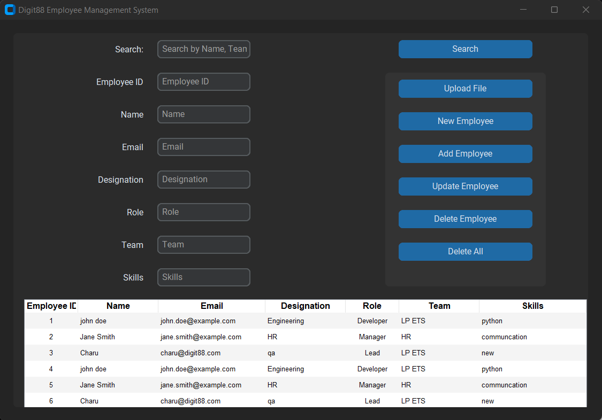

# Employee Management System

**Employee Management System** is a Python-based application built using **CustomTkinter** and **SQLite** for managing employee information. This system allows users to add, update, delete, and search employee records. It also includes the ability to upload employee data from CSV or Excel files, view statistics in graphical form, and manage the database for employee records.

## Features:
- **Add Employee**: Add new employee details such as ID, Name, Email, Designation, Role, Team, and Skills.
- **Update Employee**: Update details of an existing employee.
- **Delete Employee**: Delete an employee record based on Employee ID.
- **Search Employees**: Search employee records by Name, ID, Team, Role, or Skills.
- **Upload Employee Data**: Upload employee data from CSV or Excel files.
- **Employee Statistics**: View graphical representation of employee data (e.g., employee count per role).
- **Delete All Employees**: Remove all employee records from the database.

## Technologies Used:
- **Python 3.x**
- **CustomTkinter**: For the graphical user interface (GUI).
- **SQLite**: For storing employee records in a local database.
- **Pandas**: For handling CSV and Excel file uploads.
- **Matplotlib**: For generating graphs and charts.

## Requirements:
Before running the application, make sure you have the following installed:
- Python 3.x
- pip (Python package manager)

### Libraries:
You need to install some required libraries. You can install them using `pip` by running:

```bash
pip install customtkinter pandas matplotlib sqlite3
```

## How to Run:

1. **Clone the Repository**:
   Clone the repository to your local machine.

   ```bash
   git clone https://github.com/yourusername/employee-management-system.git
   ```

2. **Navigate to the Project Directory**:

   ```bash
   cd EmployeeManagementSystem
   ```

3. **Run the Program**:

   After installing the dependencies, run the application using:

   ```bash
   python main.py
   ```
## Screenshots:

### Main Interface


## Future Improvements:
- Implement user authentication and authorization (e.g., admin and user roles).
- Improve the user interface with more interactive elements.
- Allow exporting employee data to PDF, Excel, or CSV.

## License:
This project is licensed under the MIT License - see the [LICENSE](LICENSE) file for details.
